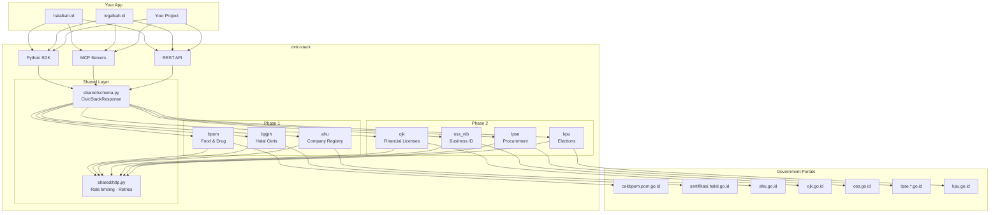
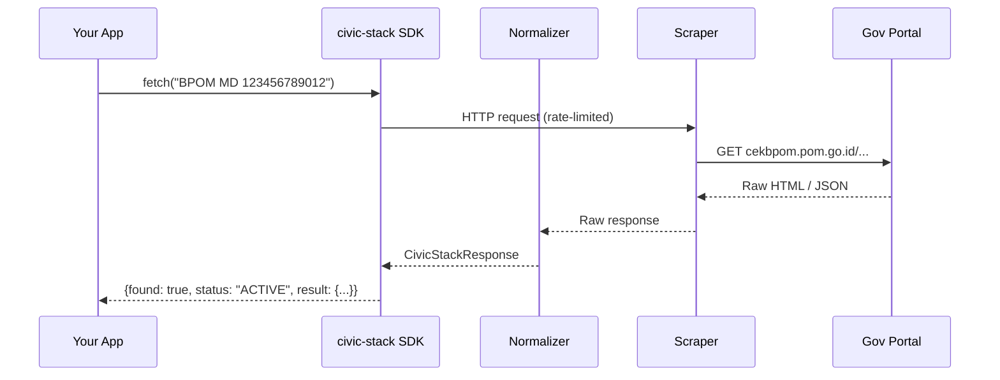
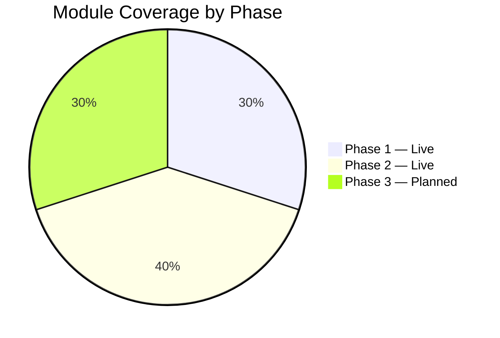
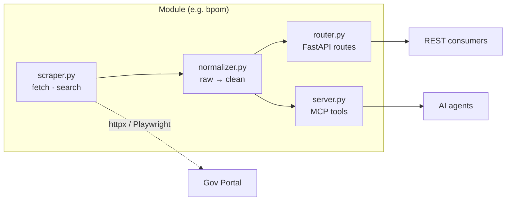
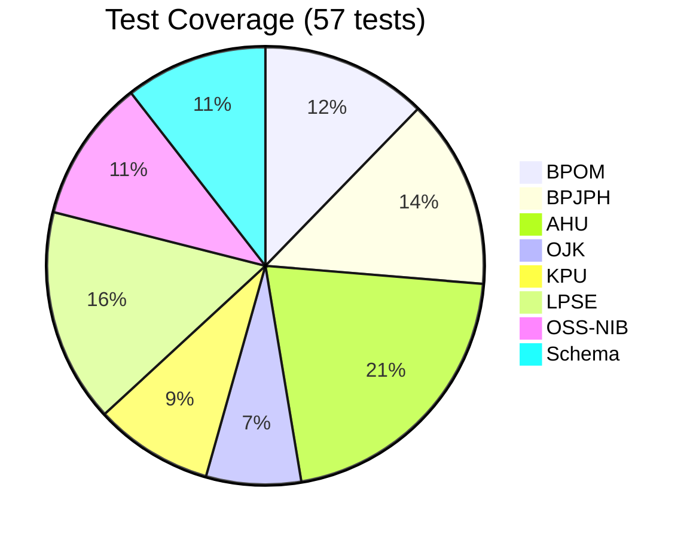

# 🇮🇩 indonesia-civic-stack

Production-ready scrapers, normalizers, and API wrappers for Indonesian government data sources.

The infrastructure layer beneath [halalkah.id](https://halalkah.id), [legalkah.id](https://legalkah.id), and a public good for the Indonesian civic tech and developer community.

---

## Why

Indonesian public data is nominally open but practically inaccessible. Every developer building civic tooling re-solves the same scraping problems independently: BPOM product registrations, BPJPH halal certificates, AHU company records. Scrapers bit-rot within months as portals change. There is no shared, maintained layer.

**This repo is that layer.** One `pip install` to query Indonesian government portals — no more bespoke scrapers.

---

## Architecture



## Request Flow



## Module Status



---

## Modules

| Module | Source | Data | Status |
|---|---|---|---|
| [`bpom`](modules/bpom/README.md) | cekbpom.pom.go.id | Food, drug, cosmetic registrations | ✅ Phase 1 |
| [`bpjph`](modules/bpjph/README.md) | sertifikasi.halal.go.id | Halal certificates (BPJPH + MUI) | ✅ Phase 1 |
| [`ahu`](modules/ahu/README.md) | ahu.go.id | Company registry — PT, CV, Yayasan, Koperasi | ✅ Phase 1 |
| [`ojk`](modules/ojk/) | ojk.go.id | Licensed financial institutions + Waspada list | ✅ Phase 2 |
| [`oss_nib`](modules/oss_nib/) | oss.go.id | Business identity (NIB) | ✅ Phase 2 |
| [`lpse`](modules/lpse/) | lpse.*.go.id | Government procurement (5 major portals) | ✅ Phase 2 |
| [`kpu`](modules/kpu/) | kpu.go.id | Election data — candidates, results, finance | ✅ Phase 2 |
| `lhkpn` | elhkpn.kpk.go.id | Wealth declarations (officials) | 🔜 Phase 3 |
| `bps` | bps.go.id | Statistical datasets (1,000+) | 🔜 Phase 3 |
| `bmkg` | bmkg.go.id | Disaster and weather data | 🔜 Phase 3 |

Every module returns the same `CivicStackResponse` envelope — swap data sources without touching application logic.

---

## Visualiser

Explore the module architecture interactively: **[docs/visualiser.html](docs/visualiser.html)**

Features:
- Module cards with component checklists
- Filter by phase or search
- Architecture diagram
- Dark theme with Indonesian flag colors

---

## Quick Start

### Python SDK

```python
import asyncio
from modules.bpom import fetch as bpom_fetch
from modules.bpjph import fetch as bpjph_fetch
from modules.ahu import fetch as ahu_fetch

async def main():
    # Check a BPOM product registration
    product = await bpom_fetch("BPOM MD 123456789012")
    print(product.status)                  # ACTIVE
    print(product.result["company"])       # PT INDOFOOD SUKSES MAKMUR TBK

    # Look up a halal certificate
    cert = await bpjph_fetch("ID00110019882120240001")
    print(cert.result["product_list"])     # ["MIE GORENG SPESIAL", ...]

    # Check a company in AHU
    company = await ahu_fetch("PT Contoh Indonesia")
    print(company.result["legal_status"])  # ACTIVE

asyncio.run(main())
```

### MCP Server (for AI agents)

```bash
# Add to Claude Desktop / any MCP client
claude mcp add civic-stack-bpom -- python -m modules.bpom.server

# Or run standalone
python -m modules.bpom.server
```

### REST API

```bash
# Run all modules
uvicorn app:app --port 8000

# With API key auth (recommended)
CIVIC_API_KEY=your-secret-key uvicorn app:app --port 8000

# Or individual module
uvicorn modules.bpom.app:app --port 8001
```

```bash
# With API key
curl -H "X-API-Key: your-secret-key" http://localhost:8000/bpom/check/MD123456789012

# Endpoints
GET /bpom/check/MD123456789012
GET /bpom/search?q=paracetamol
GET /bpjph/check/BPJPH-12345
GET /ahu/search?q=PT+Contoh+Indonesia
GET /ojk/check?name=Bank+BCA
GET /kpu/candidate/search?q=Joko
```

---

## Response Envelope

Every module returns `CivicStackResponse`:

```json
{
  "result": {"product_name": "...", "registration_status": "ACTIVE"},
  "found": true,
  "status": "ACTIVE",
  "confidence": 0.95,
  "source_url": "https://cekbpom.pom.go.id/...",
  "fetched_at": "2026-03-13T12:00:00Z",
  "module": "bpom"
}
```

| Field | Type | Description |
|-------|------|-------------|
| `result` | dict \| list | Normalized data payload |
| `found` | bool | Whether the query matched |
| `status` | enum | `ACTIVE`, `EXPIRED`, `NOT_FOUND`, `ERROR`, `DEGRADED`, `BLOCKED` |
| `confidence` | float | 0.0–1.0 data reliability score |
| `source_url` | str | Government portal URL queried |
| `module` | str | Which module produced this |

## Module Internals

Each module follows the same structure:



## Module Maturity

| Module | Scraper | Normalizer | Router | MCP | Tests | README | Dockerfile |
|--------|:-------:|:----------:|:------:|:---:|:-----:|:------:|:----------:|
| bpom | ✅ | ✅ | ✅ | ✅ | ✅ | ✅ | ✅ |
| bpjph | ✅ | ✅ | ✅ | ✅ | ✅ | ✅ | ✅ |
| ahu | ✅ | ✅ | ✅ | ✅ | ✅ | ✅ | ✅ |
| ojk | ✅ | ✅ | ✅ | ✅ | ✅ | ❌ | ✅ |
| oss_nib | ✅ | ✅ | ✅ | ✅ | ✅ | ❌ | ✅ |
| lpse | ✅ | ✅ | ✅ | ✅ | ✅ | ❌ | ✅ |
| kpu | ✅ | ✅ | ✅ | ✅ | ✅ | ❌ | ✅ |
| lhkpn | ❌ | ❌ | ❌ | ❌ | ❌ | ❌ | ❌ |
| bps | ❌ | ❌ | ❌ | ❌ | ❌ | ❌ | ❌ |
| bmkg | ❌ | ❌ | ❌ | ❌ | ❌ | ❌ | ❌ |

---

## Security

| Feature | Config | Default |
|---------|--------|---------|
| **API key auth** | `CIVIC_API_KEY` env var | Disabled (open) |
| **Rate limiting** | `CIVIC_RATE_LIMIT` env var | 60 req/min per IP |
| **Proxy allowlist** | `CIVIC_ALLOWED_PROXIES` env var | Any non-private IP |
| **SSRF prevention** | Built-in | Blocks RFC 1918 + localhost |
| **Container user** | Dockerfile | Non-root (`civicapp`, uid 1000) |

```bash
# Production deployment
export CIVIC_API_KEY="your-secret-key"
export CIVIC_RATE_LIMIT=30                          # 30 req/min
export CIVIC_ALLOWED_PROXIES="proxy.example.com"    # optional proxy allowlist
uvicorn app:app --host 0.0.0.0 --port 8000
```

---

## Docker

```bash
docker compose up                             # All modules
docker build -t civic-bpom modules/bpom/      # Individual
docker run -p 8001:8000 -e CIVIC_API_KEY=secret civic-bpom
```

---

## Development

```bash
git clone https://github.com/suryast/indonesia-civic-stack.git
cd indonesia-civic-stack
python -m venv .venv && source .venv/bin/activate
pip install -e ".[dev,playwright]"
playwright install chromium

pytest -v              # VCR replay — no live portal calls
ruff check .           # Lint
ruff format --check .  # Format check
mypy shared/           # Type check
```

---

## Tests

```bash
pytest -v                       # 57 tests, VCR replay (no live calls)
pytest tests/bpom/ -v           # Single module
pytest --tb=short -q            # Quick summary
```



---

## Contributing

See [CONTRIBUTING.md](CONTRIBUTING.md). Every module PR must include:
- `fetch()` and `search()` returning `CivicStackResponse`
- FastAPI router + FastMCP server
- 3+ VCR test fixtures
- Module README

A module that breaks for **60 days** is flagged `DEGRADED` and archived.

---

## Used By

- [**halalkah.id**](https://halalkah.id) — Halal product verification (9.57M products)
- [**legalkah.id**](https://legalkah.id) — Financial institution legality checker

## Related

- [**indonesia-gov-apis**](https://github.com/suryast/indonesia-gov-apis) — Reference docs for 50+ Indonesian government APIs

## License

MIT — see [LICENSE](LICENSE)
