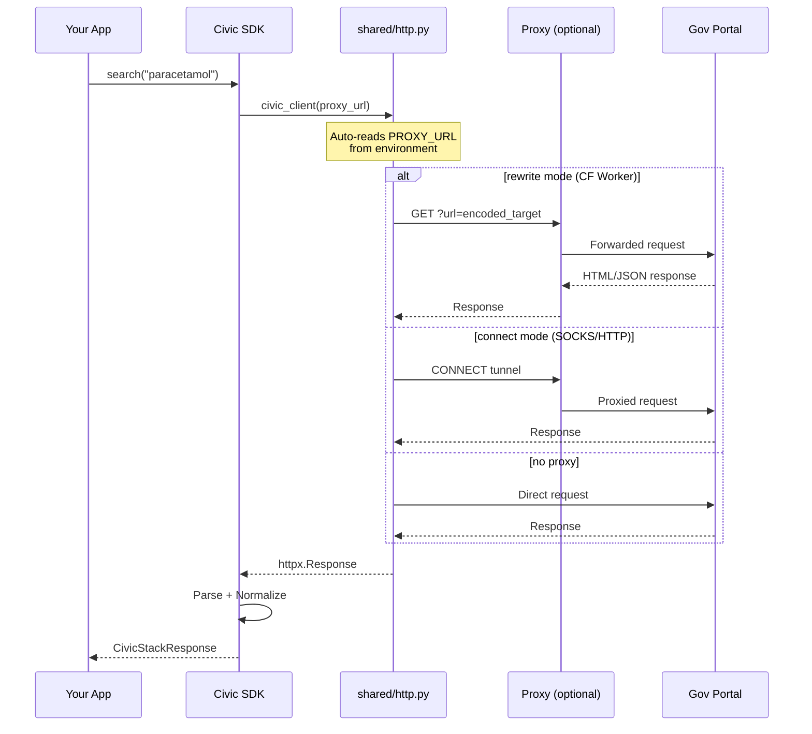
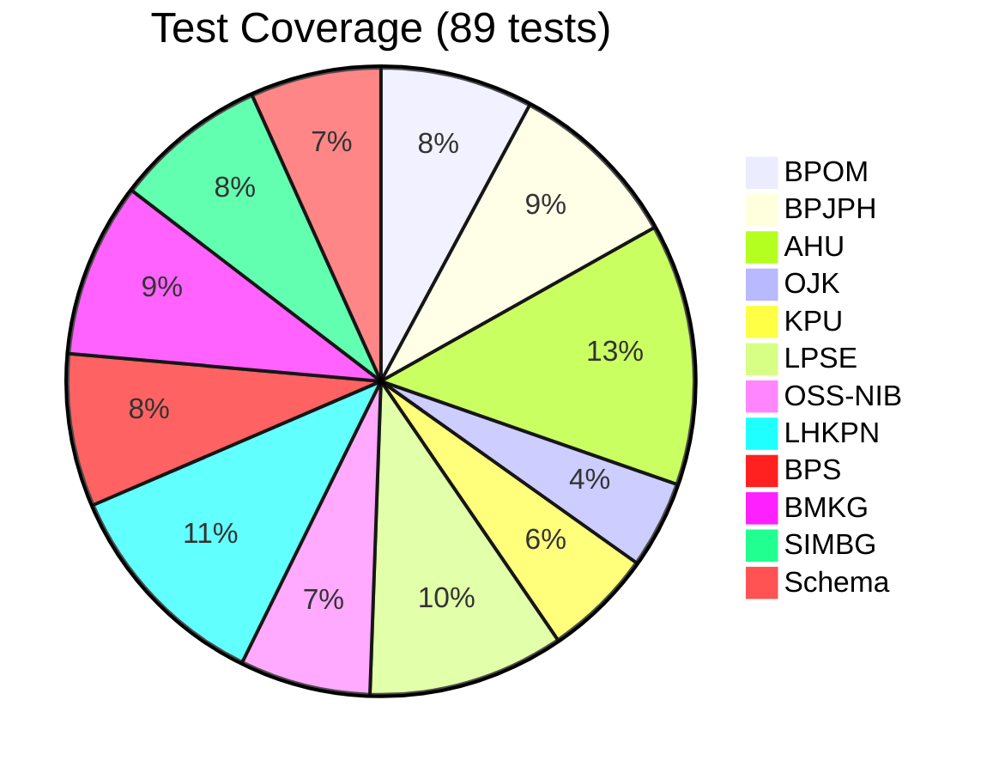
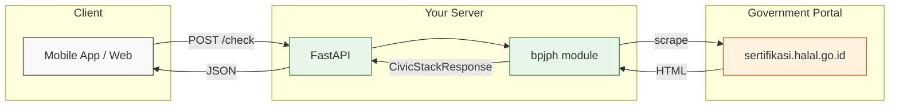
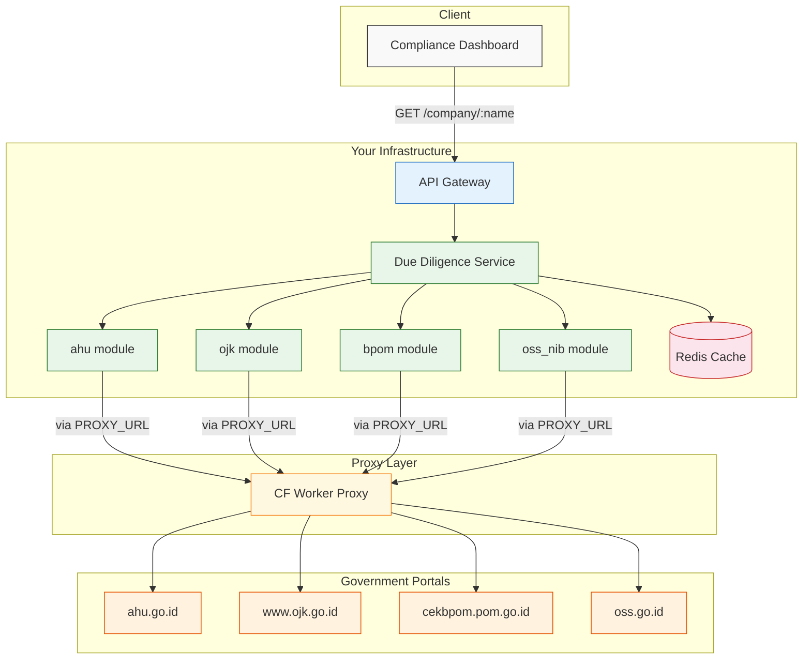
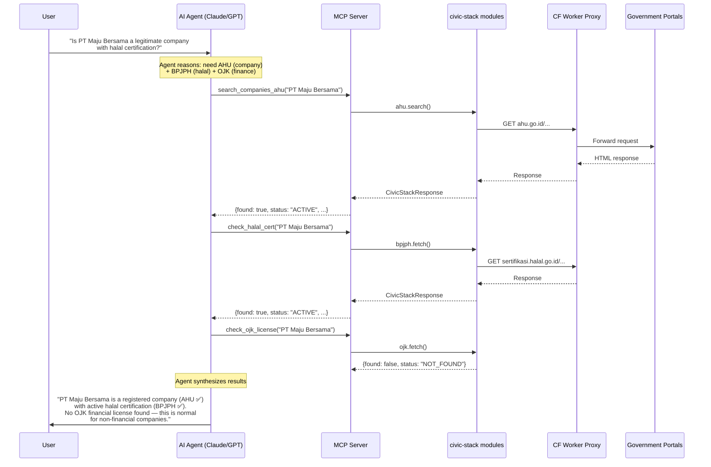

# 🇮🇩 indonesia-civic-stack

<!-- mcp-name: io.github.suryast/indonesia-civic-stack -->

[](https://pypi.org/project/indonesia-civic-stack/)
[](https://registry.modelcontextprotocol.io/servers/io.github.suryast/indonesia-civic-stack)
[](https://github.com/suryast/indonesia-civic-stack/actions)
[](https://pypi.org/project/indonesia-civic-stack/)
[](LICENSE)

Production-ready scrapers, normalizers, and API wrappers for Indonesian government data sources.

The infrastructure layer beneath [halalkah.id](https://halalkah.id), [legalkah.id](https://legalkah.id), and a public good for the Indonesian civic tech and developer community.

---

## Why

Indonesian public data is nominally open but practically inaccessible. Every developer building civic tooling re-solves the same scraping problems independently: BPOM product registrations, BPJPH halal certificates, AHU company records. Scrapers bit-rot within months as portals change. There is no shared, maintained layer.

**This repo is that layer.** One `pip install` to query Indonesian government portals — no more bespoke scrapers.

### AI-Agent First

This SDK is designed for both humans and AI agents:

- 🤖 **46 MCP tools** — plug into Claude, GPT, or any MCP-compatible agent
- 📋 **[SKILL.md](SKILL.md)** — AI agent skill discovery (AgentSkills format)
- 🧑‍💻 **[AGENTS.md](AGENTS.md)** — architecture guide for coding agents (Claude Code, Codex, Cursor)
- 📝 **[CLAUDE.md](CLAUDE.md)** — Claude Code-specific instructions
- ✅ **Typed responses** — `CivicStackResponse` envelope, never raw dicts
- 🔁 **Consistent patterns** — every module follows the same contract

---

## Architecture

```mermaid
graph TB
    subgraph "Your App"
        A[halalkah.id] 
        B[legalkah.id]
        C[Your Project]
    end

    subgraph "civic-stack"
        SDK[Python SDK]
        MCP[MCP Servers]
        API[REST API]
        
        subgraph "Shared Layer"
            SC[shared/schema.py<br/>CivicStackResponse]
            HC[shared/http.py<br/>Rate limiting · Retries · Proxy]
        end

        subgraph "Phase 1"
            BPOM[bpom<br/>Food & Drug]
            BPJPH[bpjph<br/>Halal Certs]
            AHU[ahu<br/>Company Registry]
        end

        subgraph "Phase 2"
            OJK[ojk<br/>Financial Licenses]
            OSS[oss_nib<br/>Business ID]
            LPSE[lpse<br/>Procurement]
            KPU[kpu<br/>Elections]
        end

        subgraph "Phase 3"
            LHKPN[lhkpn<br/>Wealth Declarations]
            BPS[bps<br/>Statistics]
            BMKG[bmkg<br/>Weather & Disasters]
            SIMBG[simbg<br/>Building Permits]
        end
    end

    subgraph "Government Portals"
        P1[cekbpom.pom.go.id]
        P2[sertifikasi.halal.go.id]
        P3[ahu.go.id]
        P4[ojk.go.id]
        P5[oss.go.id]
        P6[lpse.*.go.id]
        P7[infopemilu.kpu.go.id]
        P8[elhkpn.kpk.go.id]
        P9[webapi.bps.go.id]
        P10[data.bmkg.go.id]
        P11[simbg.pu.go.id]
    end

    A & B & C --> SDK & MCP & API
    SDK & MCP & API --> SC
    SC --> BPOM & BPJPH & AHU & OJK & OSS & LPSE & KPU & LHKPN & BPS & BMKG & SIMBG
    BPOM & BPJPH & AHU & OJK & OSS & LPSE & KPU & LHKPN & BPS & BMKG & SIMBG --> HC
    BPOM --> P1
    BPJPH --> P2
    AHU --> P3
    OJK --> P4
    OSS --> P5
    LPSE --> P6
    KPU --> P7
    LHKPN --> P8
    BPS --> P9
    BMKG --> P10
    SIMBG --> P11
```



---

## Request Flow



---

## Module Status

| Module | Source | Data | Proxy | Status |
|--------|--------|------|:-----:|--------|
| [`bpom`](civic_stack/bpom/) | cekbpom.pom.go.id | Food, drug, cosmetic registrations | 🌐 | ✅ Active |
| [`bpjph`](civic_stack/bpjph/) | cmsbl.halal.go.id | Halal certificates (1.98M+ records) | 🌐 | ✅ Active — migrated to REST API (v1.0.0) |
| [`ahu`](civic_stack/ahu/) | ahu.go.id | Company registry — PT, CV, Yayasan, Koperasi | 🌐 | ✅ Active |
| [`ojk`](civic_stack/ojk/) | www.ojk.go.id + sikapiuangmu.ojk.go.id | Licensed financial institutions + Waspada list | 🇮🇩 | ✅ Active — dead endpoints removed (v1.0.0) |
| [`oss_nib`](civic_stack/oss_nib/) | oss.go.id | Business identity (NIB) | 🌐 | ✅ Active |
| [`lpse`](civic_stack/lpse/) | spse.inaproc.id | Government procurement | 🇮🇩 | ✅ Active — un-deprecated (v1.0.0) |
| [`kpu`](civic_stack/kpu/) | infopemilu.kpu.go.id | Election data — candidates, results, finance | 🌐 | ✅ Active |
| [`bps`](civic_stack/bps/) | webapi.bps.go.id | Statistical datasets (1,000+) | 🌐 | ✅ Active (requires `BPS_API_KEY`) |
| [`bmkg`](civic_stack/bmkg/) | data.bmkg.go.id | Weather, earthquake, and disaster data | 🌐 | ✅ Active |
| [`simbg`](civic_stack/simbg/) | simbg.pu.go.id | Building permits (PBG) — multi-portal | 🌐 | ✅ Active |
| [`jdih`](civic_stack/jdih/) | jdih.bpk.go.id | BPK legal documents & audit reports | 🇮🇩 | ✅ **New in v1.0.0** |
| [`ksei`](civic_stack/ksei/) | ksei.co.id | Securities & investor statistics | 🇮🇩 | ✅ **New in v1.0.0** |
| [`djpb`](civic_stack/djpb/) | djpb.kemenkeu.go.id | APBN budget execution data | 🇮🇩 | ✅ **New in v1.0.0** |
| [`lhkpn`](civic_stack/lhkpn/) | elhkpn.kpk.go.id | Wealth declarations (officials) | — | ⛔ Deprecated (reCAPTCHA wall) |

🌐 = works globally &nbsp; 🇮🇩 = requires Indonesian proxy (set `PROXY_URL`)

Every module returns the same `CivicStackResponse` envelope — swap data sources without touching application logic.

### Module Maturity

| Module | Scraper | Normalizer | MCP | Tests | Portal Status |
|--------|:-------:|:----------:|:---:|:-----:|:------------:|
| bpom | ✅ | ✅ | ✅ | ✅ | ✅ |
| bpjph | ✅ | ✅ | ✅ | ✅ | ✅ REST API |
| ahu | ✅ | ✅ | ✅ | ✅ | ✅ |
| ojk | ✅ | ✅ | ✅ | ✅ | 🇮🇩 geo-blocked |
| oss_nib | ✅ | ✅ | ✅ | ✅ | ✅ |
| lpse | ✅ | ✅ | ✅ | ✅ | 🇮🇩 geo-blocked |
| kpu | ✅ | ✅ | ✅ | ✅ | ✅ |
| bps | ✅ | ✅ | ✅ | ✅ | ✅ |
| bmkg | ✅ | ✅ | ✅ | ✅ | ✅ |
| simbg | ✅ | ✅ | ✅ | ✅ | ✅ |
| jdih | ✅ | ✅ | ✅ | ✅ | 🇮🇩 geo-blocked |
| ksei | ✅ | ✅ | ✅ | ✅ | 🇮🇩 geo-blocked |
| djpb | ✅ | ✅ | ✅ | ✅ | 🇮🇩 geo-blocked |
| lhkpn | ✅ | ✅ | ⛔ | ✅ | ⛔ Deprecated |

---

## Quick Start

### Install

```bash
pip install indonesia-civic-stack          # Core SDK
pip install "indonesia-civic-stack[mcp]"   # + MCP server (40 tools)
pip install "indonesia-civic-stack[api]"   # + REST API (FastAPI + uvicorn)
pip install "indonesia-civic-stack[all]"   # Everything
```

### Python SDK

```python
import asyncio
from civic_stack.bpom.scraper import search as bpom_search
from civic_stack.bmkg.scraper import get_latest_earthquake

async def main():
    # Search BPOM product registry
    results = await bpom_search("paracetamol")
    for r in results:
        if r.found:
            print(r.result)

    # Get latest earthquake
    eq = await get_latest_earthquake()
    print(eq.result)  # {'date': '...', 'magnitude': '5.2', ...}

asyncio.run(main())
```

### MCP Server (for AI agents)

All 14 modules expose **46 MCP tools** for use with Claude, GPT, or any MCP-compatible agent.

```bash
# Fastest — use the hosted server (no install):
claude mcp add civic-stack --transport http https://mcp-server-production-d1a2.up.railway.app/mcp

# Or install locally:
pip install "indonesia-civic-stack[mcp]"
claude mcp add civic-stack -- civic-stack-mcp
```

MCP server classes support two init styles:

```python
# Style 1: Explicit init
class BpomMCPServer(CivicStackMCPBase):
    def __init__(self):
        super().__init__("bpom")

# Style 2: Class attribute
class BmkgMCPServer(CivicStackMCPBase):
    module_name = "bmkg"
```

### REST API

```bash
# Run all modules
uvicorn app:app --port 8000

# With API key auth (recommended)
CIVIC_API_KEY=your-secret-key uvicorn app:app --port 8000

# Individual module
uvicorn modules.bpom.app:app --port 8001

# With proxy
PROXY_URL=socks5://id-proxy:1080 uvicorn app:app --port 8000
```

```bash
# Endpoints
GET /bpom/check/MD123456789012
GET /bpom/search?q=paracetamol
GET /bpjph/check/BPJPH-12345
GET /ahu/search?q=PT+Contoh+Indonesia
GET /ojk/check?name=Bank+BCA
GET /kpu/candidate/search?q=Joko
GET /lhkpn/search?q=Anies          # ⚠️ DEGRADED — portal behind auth
GET /bps/search?q=inflasi           # Requires BPS_API_KEY
GET /bmkg/weather?city=jakarta
GET /simbg/search?q=Jakarta+Selatan
```

---

## Response Envelope

Every module returns `CivicStackResponse`:

```json
{
  "result": {"product_name": "...", "registration_status": "ACTIVE"},
  "found": true,
  "status": "ACTIVE",
  "confidence": 1.0,
  "source_url": "https://cekbpom.pom.go.id/...",
  "fetched_at": "2026-03-14T06:30:00Z",
  "module": "bpom"
}
```

Status values: `ACTIVE`, `EXPIRED`, `SUSPENDED`, `REVOKED`, `NOT_FOUND`, `ERROR`.

When a module can't reach its portal or is missing configuration (e.g., `BPS_API_KEY`), it returns an error envelope instead of crashing:

```json
{
  "result": null,
  "found": false,
  "status": "ERROR",
  "confidence": 0.0,
  "source_url": "https://webapi.bps.go.id",
  "module": "bps",
  "detail": "BPS_API_KEY not set. Register at https://webapi.bps.go.id/developer/register"
}
```

---

## Module Internals

```
civic_stack/bpom/
├── __init__.py
├── app.py          # FastAPI application
├── normalizer.py   # Raw HTML/JSON → structured dict
├── router.py       # FastAPI routes
├── scraper.py      # fetch() + search() — core logic
├── server.py       # FastMCP MCP server
├── Dockerfile
└── README.md
```

The `shared/` layer provides:
- **`schema.py`** — `CivicStackResponse` Pydantic model, status enum, helper constructors
- **`http.py`** — `civic_client()` factory with auto-proxy, rate limiter, exponential backoff retry, URL rewriting for CF Worker proxies
- **`mcp.py`** — `CivicStackMCPBase` abstract base class for MCP servers

---

## Deployment Notes

### Geo-blocking & Proxy Requirements

Most Indonesian government portals (`*.go.id`) restrict access to Indonesian IP addresses. If deploying outside Indonesia, you **must** set `PROXY_URL` to route requests through an Indonesian endpoint.

```bash
# Option 1: Indonesian VPS/SOCKS proxy (recommended for production)
export PROXY_URL="socks5://id-proxy.example.com:1080"
export PROXY_MODE="connect"

# Option 2: CF Worker proxy (free, but limited — see below)
export PROXY_URL="https://your-proxy.workers.dev"
# PROXY_MODE auto-detects "rewrite" for *.workers.dev
```

**Without a proxy, expect:** DNS resolution failures, connection timeouts, or HTTP 403/404 responses from most modules.

The SDK auto-reads `PROXY_URL` from environment — no code changes needed in scrapers or MCP servers.

#### Proxy Modes

| Mode | `PROXY_URL` example | How it works |
|------|---------------------|--------------|
| `connect` | `socks5://id-proxy:1080` | Standard HTTP/SOCKS CONNECT proxy via httpx transport |
| `rewrite` | `https://x.workers.dev` | Rewrites URLs to `?url=<target>` (auto-detected for `*.workers.dev`) |
| `none` | _(unset)_ | Direct connection |

Override auto-detection with `PROXY_MODE=connect|rewrite`.

#### CF Worker Proxy

A ready-to-deploy CF Worker proxy is included in [`proxy/`](proxy/). Deploy with:

```bash
cd proxy && npx wrangler deploy
```

> **⚠️ CF Worker limitation:** Many `.go.id` portals are themselves behind Cloudflare. CF Workers making `fetch()` calls to other CF-protected origins receive 403/522 errors. This is a known Cloudflare limitation.

**Verified through CF Worker proxy:**

| Portal | Status | Notes |
|--------|--------|-------|
| data.bmkg.go.id | ✅ Works | JSON API, not behind CF |
| cekbpom.pom.go.id | ❌ 403/522 | Portal is CF-protected |
| api.ojk.go.id | ❌ DNS dead | NXDOMAIN since March 2026 |
| infopemilu.kpu.go.id | ❌ 403 | CF-protected |
| lpse.*.go.id | ❌ 403 | CF-protected |
| elhkpn.kpk.go.id | ❌ 403 | reCAPTCHA v3 enforced on search |

**For production with CF-protected portals**, use an Indonesian VPS with a SOCKS5/HTTP proxy and set `PROXY_MODE=connect`.

### Geo-Restriction Test Results (March 2026)

Tested from three locations to map which portals enforce geo-blocking vs WAF:

| Portal | Sydney (AU) | Singapore | Jakarta (ID) | Verdict |
|--------|:-----------:|:---------:|:------------:|---------|
| ahu.go.id | ❌ | ✅ | ✅ | Geo-blocked (SEA+ OK) |
| elhkpn.kpk.go.id | ❌ | ✅ | ✅ | Geo-blocked (SEA+ OK) |
| ojk.go.id | ❌ 403 | ❌ 403 | ✅ | **ID-only** |
| jaga.id (KPK) | ✅ | ✅ | ✅ | No restriction |
| data.bmkg.go.id | ✅ | ✅ | ✅ | No restriction |
| cekbpom.pom.go.id | ⚠️ | ⚠️ | ⚠️ | CF-protected (all locations) |
| webapi.bps.go.id | ❌ 403 | ❌ 403 | ❌ 403 | WAF, not geo (needs API key) |
| lpse.lkpp.go.id | ❌ | ❌ | ❌ | Unreliable (all locations) |
| coretaxdjp.pajak.go.id | ❌ | ❌ | ❌ | Unreliable (all locations) |

**Takeaway:** An Indonesian proxy (e.g., CloudKilat Jakarta) unlocks OJK — the most important geo-restricted portal. Singapore unlocks AHU + LHKPN. BPS and LPSE failures are not geo-related.

### VPS Hardening Lesson

> ⚠️ **Never disable password auth and restart sshd in one automated script on a fresh VPS.** If the SSH key wasn't copied correctly, you're locked out with no recovery path except a web console. Always: (1) copy key, (2) verify key login works in a *separate session*, (3) *then* disable password auth.

### Portal URL Stability

Indonesian government portals frequently change their URL structure without notice. Known changes as of March 2026:

| Module | Old URL | New URL | Status |
|--------|---------|---------|--------|
| BPOM | `/index.php/home/produk/1/{keyword}/...` | `/all-produk?q={keyword}` | ✅ Updated |
| KPU | `/Pemilu/caleg/list` | `/Pemilu/Peserta_pemilu` | ✅ Updated |
| BMKG | `/DataMKG/MEWS/Warning/cuacasignifikan.json` | `/DataMKG/TEWS/gempadirasakan.json` | ✅ Updated |
| LHKPN | `/portal/user/check_search_announ` | reCAPTCHA v3 | 🔴 Degraded |

Modules that fail for **60 days** are flagged `DEGRADED` and may be archived.

### Browser-Based Modules

Some portals require a real browser (JavaScript rendering, anti-bot protection):

| Module | Browser | Anti-bot |
|--------|---------|----------|
| bpjph | Playwright (Chromium) | Standard |
| ahu | Playwright + Camoufox | Bot management (datacenter IP blocking) |
| oss_nib | Playwright (Chromium) | Standard |

Install browser dependencies:
```bash
pip install ".[playwright]"
playwright install chromium

# For AHU (optional, improves success rate):
pip install camoufox && python -m camoufox fetch
```

### API Keys

| Module | Key Required | Env Var | Registration |
|--------|-------------|---------|--------------|
| BPS | Yes | `BPS_API_KEY` | [webapi.bps.go.id/developer/register](https://webapi.bps.go.id/developer/register) (free) |
| All others | No | — | — |

Without `BPS_API_KEY`, the BPS module returns an error envelope (not a crash):
```json
{"status": "ERROR", "detail": "BPS_API_KEY not set. Register at ..."}
```

### MCP Tool Inventory

All 11 modules expose **40 MCP tools** total:

| Module | Tools | Count |
|--------|-------|:-----:|
| bpom | `check_bpom`, `search_bpom`, `get_bpom_status` | 3 |
| bpjph | `check_halal_cert`, `lookup_halal_by_product`, `get_halal_status`, `cross_reference_halal_bpom` | 4 |
| ahu | `lookup_company_ahu`, `get_company_directors`, `verify_company_status`, `search_companies_ahu` | 4 |
| ojk | `check_ojk_license`, `search_ojk_institutions`, `get_ojk_status`, `check_ojk_waspada` | 4 |
| oss_nib | `lookup_nib`, `verify_nib`, `search_oss_businesses` | 3 |
| lpse | `lookup_vendor_lpse`, `search_lpse_vendors`, `search_lpse_tenders`, `get_lpse_portals` | 4 |
| kpu | `get_candidate`, `search_kpu_candidates`, `get_election_results_kpu`, `get_campaign_finance_kpu` | 4 |
| lhkpn | `get_lhkpn`, `search_lhkpn`, `compare_lhkpn`, `get_lhkpn_pdf` | 4 |
| bps | `search_bps_datasets`, `get_bps_indicator`, `list_bps_regions` | 3 |
| bmkg | `get_bmkg_alerts`, `get_weather_forecast`, `get_earthquake_history`, `get_latest_earthquake` | 4 |
| simbg | `lookup_building_permit`, `search_permits_by_area`, `list_simbg_portals` | 3 |

---

## AI Agent Integration

This repo is built for AI agents as first-class consumers.

### For AI Coding Agents

| File | Purpose | Agent |
|------|---------|-------|
| [`AGENTS.md`](AGENTS.md) | Architecture, patterns, critical rules, gotchas | All coding agents |
| [`CLAUDE.md`](CLAUDE.md) | Commands, do/don't rules, style guide | Claude Code |
| [`.cursorrules`](.cursorrules) | Project rules for Cursor | Cursor |
| [`.github/copilot-instructions.md`](.github/copilot-instructions.md) | Instructions for Copilot | GitHub Copilot |
| [`CONTRIBUTING.md`](CONTRIBUTING.md) | Module contract + PR checklist | All |
| [`SKILL.md`](SKILL.md) | Skill discovery (AgentSkills format) | Skill-aware agents |
| [`PROMPTS.md`](PROMPTS.md) | Example prompts + interactive artifact recipes | All AI agents |

### Connect MCP Tools (Pick One)

**Option A — Remote server (no install needed):**

```bash
# Claude Code
claude mcp add civic-stack --transport http https://mcp-server-production-d1a2.up.railway.app/mcp

# Claude Desktop — add to claude_desktop_config.json:
```

```json
{
  "mcpServers": {
    "civic-stack": {
      "transport": "streamable-http",
      "url": "https://mcp-server-production-d1a2.up.railway.app/mcp"
    }
  }
}
```

**Option B — Local install via pip:**

```bash
pip install "indonesia-civic-stack[mcp]"
claude mcp add civic-stack -- civic-stack-mcp
```

**Option C — Clone repo (auto-discovery):**

```bash
git clone https://github.com/suryast/indonesia-civic-stack.git
cd indonesia-civic-stack
pip install -e ".[mcp]"
claude  # Claude Code auto-detects .mcp.json — 40 tools available immediately
```

All three options give you the same 40 tools. Then ask:

> "Check if BPOM registration MD 123456789 is still active"
> "Search for companies named 'Maju Bersama' in the AHU registry"
> "What was the latest earthquake in Indonesia?"

See [PROMPTS.md](PROMPTS.md) for more example prompts and interactive artifact recipes.

### REST API

```bash
pip install "indonesia-civic-stack[api]"
civic-stack api --port 8000
# GET http://localhost:8000/bpom/search?q=paracetamol
```

### Example Prompts

Once MCP tools are connected, try these with your AI agent:

> **Food Safety**
> "Check if BPOM registration number `MD 123456789` is still active"
> "Search for all paracetamol products registered with BPOM"

> **Halal Verification**
> "Is product XYZ halal certified? Cross-reference with BPOM registration"
> "Find all halal certificates issued to PT Indofood"

> **Company Due Diligence**
> "Look up PT Maju Bersama in the AHU company registry and check who the directors are"
> "Is this company OJK-licensed? Check both the license registry and the waspada (warning) list"

> **Public Finance**
> "Search LHKPN wealth declarations for officials in Jakarta"
> "Find government procurement tenders for road construction on LPSE"

> **Disaster & Weather**
> "What was the latest earthquake in Indonesia?"
> "Get the weather forecast for DKI Jakarta from BMKG"

> **Statistics**
> "Find BPS datasets about poverty rates by province"
> "Get the inflation indicator for the last 5 years"

> **Multi-Source Queries**
> "I want to verify a food company: check AHU for registration, OJK for financial license, BPOM for product registrations, and BPJPH for halal certificates"
> "Compare LHKPN wealth declarations for these two officials over the last 3 reporting periods"

### Design Decisions for AI Agents

1. **Uniform response envelope** — every tool returns `CivicStackResponse` with the same fields. Agents don't need module-specific parsing logic.
2. **Error envelopes, not exceptions** — agents receive structured error info they can reason about, not stack traces.
3. **Self-documenting tools** — MCP tool descriptions include parameter types, expected values, and response format.
4. **Deterministic naming** — `check_<module>`, `search_<module>`, `get_<module>_status` pattern across all modules.

---

## Security

| Feature | Config | Default |
|---------|--------|---------|
| **API key auth** | `CIVIC_API_KEY` env var | Disabled (open) |
| **Rate limiting** | `CIVIC_RATE_LIMIT` env var | 60 req/min per IP |
| **Proxy allowlist** | `CIVIC_ALLOWED_PROXIES` env var | Any non-private IP |
| **SSRF prevention** | Built-in | Blocks RFC 1918 + localhost |
| **Container user** | Dockerfile | Non-root (`civicapp`, uid 1000) |

```bash
# Production deployment
export CIVIC_API_KEY="your-secret-key"
export CIVIC_RATE_LIMIT=30                          # 30 req/min
export CIVIC_ALLOWED_PROXIES="proxy.example.com"    # optional proxy allowlist
export PROXY_URL="socks5://id-proxy:1080"           # Indonesian proxy
uvicorn app:app --host 0.0.0.0 --port 8000
```

---

## Docker

```bash
docker compose up                             # All modules
docker build -t civic-bpom civic_stack/bpom/      # Individual
docker run -p 8001:8000 -e CIVIC_API_KEY=secret -e PROXY_URL=socks5://proxy:1080 civic-bpom
```

---

## Development

```bash
git clone https://github.com/suryast/indonesia-civic-stack.git
cd indonesia-civic-stack
python -m venv .venv && source .venv/bin/activate
pip install -e ".[all,dev]"
playwright install chromium

pytest -v              # VCR replay — no live portal calls
ruff check .           # Lint
ruff format --check .  # Format check
mypy shared/           # Type check
```

---

## Tests

```bash
pytest -v                       # 89 tests, VCR replay (no live calls)
pytest tests/bpom/ -v           # Single module
pytest --tb=short -q            # Quick summary
```



---

## Contributing

See [CONTRIBUTING.md](CONTRIBUTING.md). Every module PR must include:
- `fetch()` and `search()` returning `CivicStackResponse`
- FastAPI router + FastMCP server
- 3+ VCR test fixtures
- Module README

A module that breaks for **60 days** is flagged `DEGRADED` and archived.

---

## Used By

- [**halalkah.id**](https://halalkah.id) — Halal product verification (9.57M products)
- [**legalkah.id**](https://legalkah.id) — Financial institution legality checker
- [**datarakyat.id**](https://datarakyat.id) — Landing page & documentation

## Sample Architectures

### Simple: Halal Product Checker

A single-page app that checks if a product is halal-certified. One module, no proxy needed for Indonesian users.



```python
# app.py — 15 lines, production-ready
from fastapi import FastAPI
from civic_stack.bpjph.scraper import fetch

app = FastAPI()

@app.get("/check/{product_id}")
async def check_halal(product_id: str):
    result = await fetch(product_id)
    return {"halal": result.found, "data": result.result}
```

---

### Intermediate: Multi-Source Due Diligence API

A compliance tool that cross-checks a company across multiple government databases. Runs behind a proxy for overseas deployment.



```python
# due_diligence.py — parallel checks across 4 portals
import asyncio
from civic_stack.ahu.scraper import search as ahu_search
from civic_stack.ojk.scraper import search as ojk_search
from civic_stack.bpom.scraper import search as bpom_search
from civic_stack.oss_nib.scraper import search as nib_search

async def check_company(name: str) -> dict:
    ahu, ojk, bpom, nib = await asyncio.gather(
        ahu_search(name),
        ojk_search(name),
        bpom_search(name),
        nib_search(name),
    )
    return {
        "company": name,
        "registered": any(r.found for r in ahu),
        "ojk_licensed": any(r.found for r in ojk),
        "bpom_products": len([r for r in bpom if r.found]),
        "nib_valid": any(r.found for r in nib),
        "risk_flags": _assess_risk(ahu, ojk, bpom, nib),
    }
```

---

### Advanced: AI Agent with MCP Tools

An AI assistant that answers natural language questions about Indonesian civic data using MCP tools. The agent reasons about which portals to query.



```bash
# Connect MCP servers to Claude Desktop — one command per module
claude mcp add civic-ahu   -- python -m civic_stack.ahu.server
claude mcp add civic-bpjph -- python -m civic_stack.bpjph.server
claude mcp add civic-ojk   -- python -m civic_stack.ojk.server

# Or run unified REST API for HTTP-based agents
PROXY_URL=https://your-proxy.workers.dev uvicorn app:app
```

---

## Related

- [**indonesia-civic-signal-monitor**](https://github.com/suryast/indonesia-civic-signal-monitor) — Anomaly detection engine built on this SDK, monitors 11 government data sources for newsworthy changes
- [**indonesia-gov-apis**](https://github.com/suryast/indonesia-gov-apis) — Reference docs for 50+ Indonesian government APIs
- [**datarakyat.id**](https://datarakyat.id) — Project homepage with full module documentation

## License

MIT — see [LICENSE](LICENSE)
